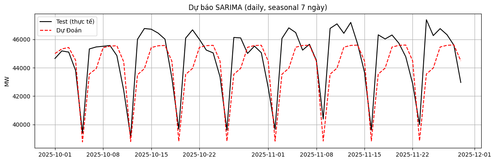

# Dự án dự đoán đỉnh phụ tải điện Việt Nam bằng SARIMA

## Mục tiêu
Dự án nhằm dự đoán đỉnh phụ tải điện (peak load) cho hệ thống điện Việt Nam. Mô hình SARIMA được sử dụng để nắm đặc tính theo mùa và chu kỳ trong dữ liệu phụ tải.

## Thu thập dữ liệu
- Crawl data hằng ngày từ web EVN từ ngày 7/4/2023 đến 11/29/2025.
- Thu thập dữ liệu đỉnh kỳ phụ tải điện theo ngày/tuần/tháng từ EVN, lưu trong file `evn_peak_MW.csv`.
- Kiểm tra và lọc bỏ các giá trị khuyết hoặc ngoại lai.

## Tiền xử lý và trực quan hoá dữ liệu
- Sử dụng Python (pandas, matplotlib) để đọc dữ liệu, chuyển đổi định dạng thời gian.
- Vẽ đồ thị xu hướng (trend) và chu kỳ theo mùa (seasonal decomposition) để nhận diện cấu trúc dữ liệu.
- Chia dữ liệu thành tập huấn luyện và tập kiểm thử.

## Mô hình SARIMA
- Lựa chọn mô hình Seasonal ARIMA (SARIMA) với tham số `seasonal_order=(1,1,1,7)` để bắt chu kỳ  tuần/năm.
- Huấn luyện mô hình trên tập huấn luyện và tinh chỉnh tham số bằng việc quan sát AIC/BIC.
- Dự đoán giá trị phụ tải đỉnh trên tập kiểm thử.

## Đánh giá mô hình
- Tính các chỉ số sai số như RMSE, MAE và MAPE để đánh giá hiệu suất mô hình.
- Vẽ đồ thị so sánh giá trị thực tế và giá trị dự đoán trên tập kiểm thử.

## Kết quả
- RMSE = 1569.201
- MAPE = 2.726%

- Mô hình SARIMA dự đoán khá tốt xu hướng và mức đỉnh phụ tải điện, sai số thấp.
- Biểu đồ so sánh cho thấy dự đoán bám sát giá trị thực tế trong giai đoạn kiểm thử.

## Đề xuất cải tiến
- Thử nghiệm các tham số khác cho mô hình SARIMA hoặc các mô hình thống kê khác.
- Kết hợp thêm các yếu tố ảnh hưởng như thời tiết, kinh tế, nhu cầu tiêu thụ.
- Nghiên cứu các mô hình machine learning/ deep learning khác như LSTM, Prophet.
